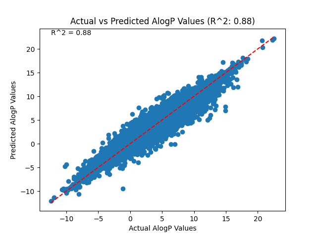
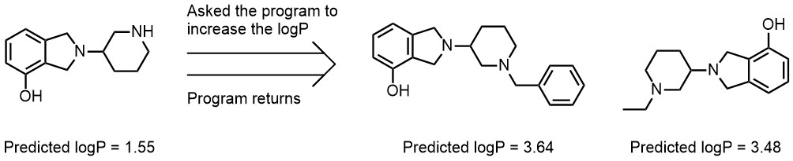

# logP predictor and iterator
## Introduction
[Lipophilicity](https://en.wikipedia.org/wiki/Lipophilicity) is a crucial determinant of how a drug behaves in the human body. By predicting the [logP values of organic molecules](https://en.wikipedia.org/wiki/Partition_coefficient), we can gauge their potential therapeutic efficacy, absorption, distribution, metabolism, and excretion properties. The logP Predictor Iterator not only automates this prediction but takes a step further by offering user-driven adjustments, ensuring that researchers can obtain tailored sets of compounds that align with specific logP objectives.

## Methodology
A total of 2,311,814 compounds were extracted from the [ChEMBL database](https://www.ebi.ac.uk/chembl/). These compounds exhibited a wide range of AlogP values, specifically spanning from -14.26 to +22.67. All of this data was subsequently saved in a raw CSV file, which was then set up for further processing and filtering to meet the modeling requirements.

## Data processing
Data processing is executed through the "cleaner.py" script. This script performs a meticulous cleanup of the raw dataset obtained from the ChEMBL database. It starts by reading the raw data and then applies specific filtering criteria. Only compounds with a valid AlogP value and a proper SMILES notation are considered. Additionally, the code ensures that only organic compounds, i.e., those containing at least one carbon atom, are included. For each eligible compound, a suite of molecular descriptors, such as molecular weight, number of hydrogen acceptors and donors, and topological polar surface area, among others, are computed and stored. The final cleaned dataset is then saved in a new CSV file, making it ready for further analyses and modeling.

## Building and training the model
Having processed the data, we leverage a dense neural network using TensorFlow to train our model for predicting logP values. Here's a brief rundown of the code present in "predictor.py":

1. *Feature and Label Extraction*: The molecular descriptors, such as molecular weight and number of hydrogen acceptors/donors, are extracted to serve as features. The AlogP value is the target label.
2. *Data Splitting and Standardization*: The dataset is partitioned into training and test sets (80% for training, 20% for validation). The features are then standardized.
3. *Neural Network Architecture*: The model consists of a sequential neural network with multiple layers, primarily using ReLU as the activation function.
4. *Model Traning*: The neural network is trained on the scaled training data, running for 25 epochs and using a validation subset.
5. *Predictions*: Using the trained model, predictions for logP values are generated on the test set.
6. *Performance Visualization*: A scatter plot contrasting actual vs. predicted AlogP values is displayed, accompanied by an R^2 value indicating model performance.

### Model results
The developed model showcases a Mean Absolute Error (MAE) of 0.513 and an R^2 = 0.88. 

This performance aligns with [recent research publications](https://doi.org/10.1007/s10822-020-00292-3) where neural networks have been employed for similar purposes.

## User-Driven Molecular Modifications:
This section, present in modifier.py, of the system integrates both AI and cheminformatics techniques to predict and refine a molecule's logP. Starting with a given molecule, the system utilizes the prior model to determine its logP. Once predicted, it offers the option to either raise or lower the logP value. This adjustment is achieved by applying specific chemical transformations for late stage modification of the molecule, tailored to the user's input. Here is an example:

When the SMILES string "OC1=C(CN(C2CCCNC2)C3)C3=CC=C1" is input, the program uses the model in predictor.py to find out the molecule's logP. Then, the user is asked a simple question: do they want the logP to go up or down? If "increase" is chosen, the program looks through the "reaction pool", calculating the logP for each change. It then shows the results that fit what the user wanted. In this example, the program displays the two molecules on the right along with their logP values.

Similarly, for the above example, when "decrease" is selected, the program displays the molecule on the right as the result.

## Current and Future Work
At the moment, this project is in its "proof of concept" phase. To enhance its practicality, several improvements are on the horizon. These include expanding the reaction pool, refining the user interface, verifying the actual stability and feasibility of the molecules, and optimizing the tree search algorithm, among others.
